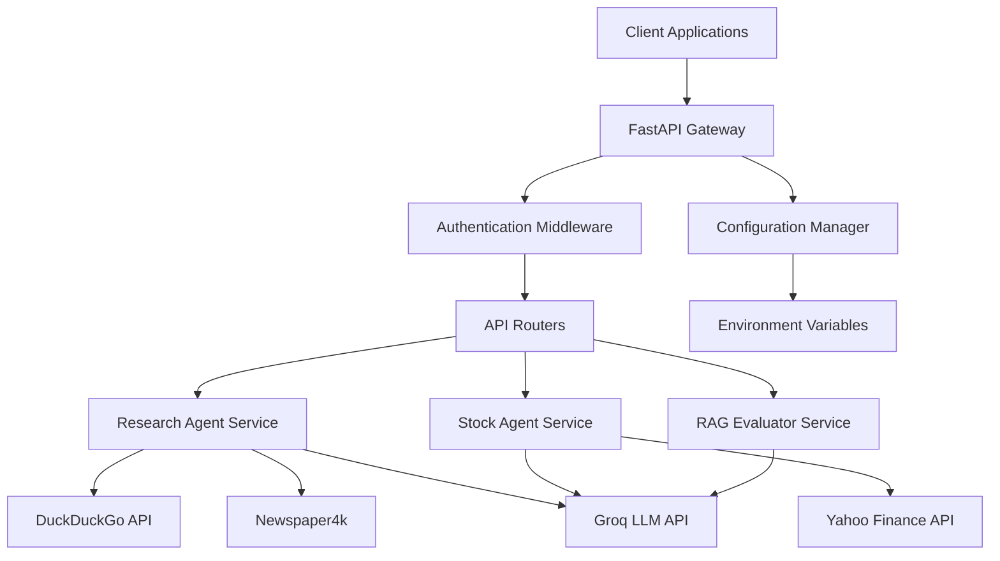

# Design Document

## Overview

The Financial AI Agents system is designed as a microservices-based architecture using FastAPI as the web framework. The system provides RESTful APIs for three specialized financial analysis agents: Financial Research Analyst, Stock Market Analyst, and RAG Evaluator. The design emphasizes modularity, scalability, and real-time streaming capabilities while maintaining clean separation of concerns.

## Architecture

### High-Level Architecture



### Service Layer Architecture

The system follows a layered architecture pattern:

1. **API Layer**: FastAPI routers and endpoints
2. **Service Layer**: Business logic and agent orchestration
3. **Agent Layer**: Specialized AI agents with specific tools
4. **Tool Layer**: External API integrations and data sources
5. **Configuration Layer**: Environment and API key management

## Components and Interfaces

### 1. FastAPI Application Structure

```
app/
├── main.py                 # FastAPI application entry point
├── config/
│   ├── __init__.py
│   ├── settings.py         # Configuration management
│   └── logging.py          # Logging configuration
├── api/
│   ├── __init__.py
│   ├── deps.py             # Dependency injection
│   └── v1/
│       ├── __init__.py
│       ├── research.py     # Research agent endpoints
│       ├── stock.py        # Stock analysis endpoints
│       └── evaluation.py   # RAG evaluation endpoints
├── services/
│   ├── __init__.py
│   ├── research_service.py
│   ├── stock_service.py
│   └── evaluation_service.py
├── agents/
│   ├── __init__.py
│   ├── base_agent.py       # Base agent interface
│   ├── research_agent.py
│   ├── stock_agent.py
│   └── rag_evaluator.py
├── models/
│   ├── __init__.py
│   ├── requests.py         # Pydantic request models
│   └── responses.py        # Pydantic response models
└── utils/
    ├── __init__.py
    ├── exceptions.py       # Custom exceptions
    └── validators.py       # Input validation
```

### 2. API Endpoints Design

#### Research Agent Endpoints
- `POST /api/v1/research/analyze` - Conduct financial research analysis
- `GET /api/v1/research/topics` - Get suggested research topics
- `POST /api/v1/research/stream` - Stream research analysis in real-time

#### Stock Analysis Endpoints
- `POST /api/v1/stocks/analyze` - Analyze individual stock
- `POST /api/v1/stocks/compare` - Compare multiple stocks
- `GET /api/v1/stocks/{symbol}/info` - Get basic stock information
- `POST /api/v1/stocks/stream` - Stream stock analysis

#### RAG Evaluation Endpoints
- `POST /api/v1/evaluation/assess` - Evaluate RAG response quality
- `GET /api/v1/evaluation/metrics` - Get evaluation criteria definitions
- `POST /api/v1/evaluation/batch` - Batch evaluate multiple responses

### 3. Agent Service Interfaces

#### Base Agent Interface
```python
from abc import ABC, abstractmethod
from typing import Dict, Any, AsyncGenerator

class BaseAgent(ABC):
    @abstractmethod
    async def process_request(self, request: Dict[str, Any]) -> Dict[str, Any]:
        pass
    
    @abstractmethod
    async def stream_response(self, request: Dict[str, Any]) -> AsyncGenerator[str, None]:
        pass
    
    @abstractmethod
    def validate_request(self, request: Dict[str, Any]) -> bool:
        pass
```

#### Service Layer Interface
```python
class AgentService:
    def __init__(self, agent: BaseAgent):
        self.agent = agent
    
    async def execute_analysis(self, request: AnalysisRequest) -> AnalysisResponse:
        # Service orchestration logic
        pass
    
    async def stream_analysis(self, request: AnalysisRequest) -> AsyncGenerator[str, None]:
        # Streaming response logic
        pass
```

## Data Models

### Request Models

```python
from pydantic import BaseModel, Field
from typing import List, Optional

class ResearchRequest(BaseModel):
    topic: str = Field(..., description="Financial research topic")
    sources_limit: int = Field(5, ge=1, le=10, description="Number of sources to search")
    include_outlook: bool = Field(True, description="Include future outlook section")

class StockAnalysisRequest(BaseModel):
    symbols: List[str] = Field(..., description="Stock symbols to analyze")
    analysis_type: str = Field("comprehensive", description="Type of analysis")
    include_comparison: bool = Field(False, description="Include comparative analysis")

class RAGEvaluationRequest(BaseModel):
    query: str = Field(..., description="Original query")
    response: str = Field(..., description="RAG response to evaluate")
    context: List[str] = Field(..., description="Context used for generation")
    evaluation_criteria: Optional[List[str]] = Field(None, description="Specific criteria to evaluate")
```

### Response Models

```python
class ResearchResponse(BaseModel):
    headline: str
    executive_summary: str
    analysis: str
    future_outlook: str
    sources: List[str]
    generated_at: str
    processing_time: float

class StockAnalysisResponse(BaseModel):
    symbols: List[str]
    analysis: Dict[str, Any]
    recommendations: Dict[str, str]
    risk_factors: List[str]
    market_sentiment: str
    generated_at: str

class RAGEvaluationResponse(BaseModel):
    scores: Dict[str, int]
    recommendations: List[str]
    summary: str
    detailed_feedback: Dict[str, str]
    overall_score: float
```

## Error Handling

### Exception Hierarchy

```python
class FinancialAgentException(Exception):
    """Base exception for financial agent system"""
    pass

class APIKeyMissingException(FinancialAgentException):
    """Raised when required API keys are missing"""
    pass

class DataSourceException(FinancialAgentException):
    """Raised when external data sources fail"""
    pass

class ValidationException(FinancialAgentException):
    """Raised when input validation fails"""
    pass

class AgentProcessingException(FinancialAgentException):
    """Raised when agent processing fails"""
    pass
```

### Error Response Format

```python
class ErrorResponse(BaseModel):
    error_code: str
    message: str
    details: Optional[Dict[str, Any]] = None
    timestamp: str
    request_id: str
```

### Error Handling Strategy

1. **API Level**: FastAPI exception handlers for consistent error responses
2. **Service Level**: Try-catch blocks with specific exception types
3. **Agent Level**: Graceful degradation when tools fail
4. **External APIs**: Retry logic with exponential backoff
5. **Logging**: Comprehensive error logging with correlation IDs

## Testing Strategy

### Unit Testing
- **Agent Tests**: Mock external APIs and test agent logic
- **Service Tests**: Test business logic and orchestration
- **API Tests**: Test endpoint behavior and validation
- **Model Tests**: Test Pydantic model validation

### Integration Testing
- **End-to-End API Tests**: Test complete request-response cycles
- **External API Integration**: Test with real external services
- **Database Integration**: Test configuration and state management
- **Streaming Tests**: Test real-time response streaming

### Performance Testing
- **Load Testing**: Test API performance under concurrent requests
- **Stress Testing**: Test system limits and failure modes
- **Memory Testing**: Test for memory leaks in long-running processes
- **Response Time Testing**: Ensure acceptable latency for all endpoints

### Test Structure
```
tests/
├── unit/
│   ├── test_agents.py
│   ├── test_services.py
│   └── test_models.py
├── integration/
│   ├── test_api_endpoints.py
│   ├── test_external_apis.py
│   └── test_streaming.py
├── performance/
│   ├── test_load.py
│   └── test_stress.py
└── fixtures/
    ├── sample_data.py
    └── mock_responses.py
```

## Configuration Management

### Environment Configuration
```python
from pydantic import BaseSettings

class Settings(BaseSettings):
    # API Keys
    groq_api_key: str
    phi_api_key: str
    
    # Application Settings
    app_name: str = "Financial AI Agents"
    debug: bool = False
    log_level: str = "INFO"
    
    # API Settings
    api_v1_prefix: str = "/api/v1"
    cors_origins: List[str] = ["*"]
    
    # Agent Settings
    default_model: str = "qwen/qwen3-32b"
    max_sources: int = 10
    request_timeout: int = 300
    
    class Config:
        env_file = ".env"
```

### Deployment Configuration
- **Development**: Local development with hot reload
- **Staging**: Docker containers with environment-specific configs
- **Production**: Kubernetes deployment with secrets management
- **Monitoring**: Health checks, metrics, and logging integration

## Security Considerations

1. **API Key Management**: Secure storage and rotation of external API keys
2. **Input Validation**: Comprehensive validation of all user inputs
3. **Rate Limiting**: Prevent abuse of expensive AI and data operations
4. **CORS Configuration**: Proper cross-origin resource sharing setup
5. **Authentication**: Optional JWT-based authentication for enterprise use
6. **Data Privacy**: Ensure no sensitive financial data is logged or cached