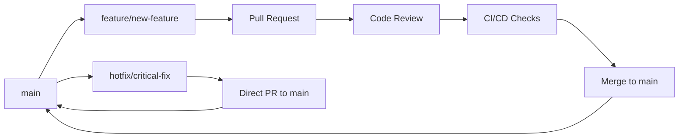

# Git Workflow Rules & Standards

## 🌳 Branching Strategy

### Branch Types

| Branch Type | Format | Purpose | Example |
|-------------|--------|---------|---------|
| **Main** | `main` | Production-ready code | `main` |
| **Feature** | `feature/description` | New features | `feature/add-visualization-charts` |
| **Hotfix** | `hotfix/issue-description` | Critical bug fixes | `hotfix/fix-api-key-validation` |
| **Release** | `release/v1.0.0` | Release preparation | `release/v1.2.0` |
| **Documentation** | `docs/topic` | Documentation updates | `docs/update-api-guide` |
| **Refactor** | `refactor/component` | Code refactoring | `refactor/research-agent` |
| **Chore** | `chore/task` | Maintenance tasks | `chore/update-dependencies` |

### Branch Naming Rules

✅ **DO:**
- Use kebab-case (lowercase with hyphens)
- Be descriptive but concise
- Include issue numbers when applicable: `feature/123-add-charts`
- Use present tense: `feature/add-charts` not `feature/added-charts`

❌ **DON'T:**
- Use spaces or special characters
- Use camelCase or snake_case
- Make names too long (>50 characters)
- Use generic names like `feature/updates`

### Branch Lifecycle



## 📝 Commit Message Standards

### Conventional Commit Format

```
<type>(<scope>): <description>

[optional body]

[optional footer(s)]
```

### Commit Types

| Type | Description | Example |
|------|-------------|---------|
| `feat` | New feature | `feat(research): add visualization charts` |
| `fix` | Bug fix | `fix(api): resolve authentication timeout` |
| `docs` | Documentation | `docs(readme): update installation guide` |
| `style` | Code style changes | `style(frontend): fix linting issues` |
| `refactor` | Code refactoring | `refactor(agents): simplify error handling` |
| `test` | Test additions/changes | `test(research): add unit tests for analysis` |
| `chore` | Maintenance tasks | `chore(deps): update dependencies` |
| `security` | Security improvements | `security(auth): implement rate limiting` |
| `perf` | Performance improvements | `perf(api): optimize database queries` |
| `ci` | CI/CD changes | `ci(github): add security scanning workflow` |

### Commit Message Examples

✅ **Good Examples:**
```bash
feat(research): add dynamic visualization data generation

- Implement topic-specific chart generation
- Support pie, line, and bar charts
- Add Federal Reserve rate trend visualization
- Include cryptocurrency market share charts

Closes #45
```

```bash
fix(security): prevent API key exposure in logs

- Mask API keys in error messages
- Update logging configuration
- Add security tests for key exposure

BREAKING CHANGE: Log format changed for security
```

```bash
docs(api): update research endpoint documentation

- Add visualization_data field description
- Include chart configuration examples
- Update response model documentation
```

❌ **Bad Examples:**
```bash
# Too vague
fix: bug fix

# Wrong tense
feat: added new feature

# No scope when needed
fix: authentication issue

# Too long description
feat(research): add a new comprehensive financial research analysis system with multi-source data aggregation and real-time streaming capabilities
```

### Commit Rules

1. **Present Tense**: Use imperative mood ("add" not "added")
2. **Length Limits**: 
   - Subject line: ≤ 72 characters
   - Body lines: ≤ 100 characters
3. **Reference Issues**: Include `Closes #123` or `Fixes #456`
4. **Breaking Changes**: Use `BREAKING CHANGE:` in footer
5. **Atomic Commits**: One logical change per commit

## 🔒 Branch Protection Rules

### Main Branch Protection

**Required Settings:**
- ✅ Require pull request reviews before merging
- ✅ Require status checks to pass before merging
- ✅ Require branches to be up to date before merging
- ✅ Include administrators (no exceptions)
- ✅ Restrict pushes that create files larger than 100MB
- ✅ Require linear history (no merge commits)

**Required Status Checks:**
- ✅ CI/CD Pipeline (lint, test, build)
- ✅ Security Scan (secrets, dependencies, code)
- ✅ Code Coverage (minimum 80%)

### Review Requirements

| File Pattern | Required Reviewers | Auto-Assign |
|--------------|-------------------|-------------|
| `app/**` | 1 code owner | @QuantumCoderX7 |
| `frontend/**` | 1 code owner | @QuantumCoderX7 |
| `.github/**` | 1 code owner | @QuantumCoderX7 |
| `*.yml`, `*.yaml` | 1 code owner | @QuantumCoderX7 |
| `.env.example` | 1 code owner | @QuantumCoderX7 |
| `requirements.txt` | 1 code owner | @QuantumCoderX7 |

## 📋 Pull Request Requirements

### PR Checklist (Auto-populated from template)

**Code Quality:**
- [ ] Code follows project style guidelines
- [ ] Self-review completed
- [ ] Code is commented appropriately
- [ ] Documentation updated
- [ ] No new warnings generated
- [ ] Tests added for new functionality
- [ ] All tests pass locally

**Security Checklist:**
- [ ] No API keys, passwords, or secrets included
- [ ] No sensitive data in logs or errors
- [ ] Input validation implemented
- [ ] No SQL injection vulnerabilities
- [ ] CORS settings appropriate
- [ ] Rate limiting considered

### PR Title Format

Use conventional commit format for PR titles:
```
feat(research): add visualization charts
fix(api): resolve authentication timeout
docs(readme): update installation guide
```

### PR Description Requirements

1. **Clear Description**: What changes were made and why
2. **Type of Change**: Bug fix, feature, breaking change, etc.
3. **Testing**: How the changes were tested
4. **Screenshots**: For UI changes
5. **Related Issues**: Link to GitHub issues
6. **Breaking Changes**: Document any breaking changes

## 🚫 Push Restrictions

### Blocked Actions

❌ **Direct pushes to main branch**
```bash
# This will be rejected
git push origin main
```

❌ **Force pushes to protected branches**
```bash
# This will be rejected
git push --force origin main
```

❌ **Commits with secrets**
```bash
# This will be rejected by pre-commit hooks
GROQ_API_KEY=gsk_real_key_here
```

❌ **Large files (>100MB)**
```bash
# This will be rejected
git add large-model-file.bin  # 150MB file
```

❌ **Commits with .env files**
```bash
# This will be rejected
git add .env
```

### Allowed Actions

✅ **Feature branch pushes**
```bash
git push origin feature/add-charts
```

✅ **Pull request creation**
```bash
gh pr create --title "feat(research): add charts" --body "Description"
```

✅ **Hotfix branches**
```bash
git push origin hotfix/critical-security-fix
```

## 🔄 Workflow Triggers

### Automatic Triggers

| Event | Workflows | Purpose |
|-------|-----------|---------|
| Push to `main` | CI/CD + Security | Full validation |
| Push to `develop` | CI/CD + Security | Development validation |
| Pull Request | CI/CD + Security | PR validation |
| Daily 2 AM UTC | Security Scan | Scheduled security check |
| Release Tag | Deploy | Automated deployment |

### Manual Triggers

| Workflow | When to Use | Who Can Trigger |
|----------|-------------|-----------------|
| Security Scan | After dependency updates | Maintainers |
| Performance Test | Before releases | Maintainers |
| Documentation Build | After doc changes | Contributors |

## 🏷️ Release Management

### Semantic Versioning

Format: `MAJOR.MINOR.PATCH`

- **MAJOR**: Breaking changes
- **MINOR**: New features (backward compatible)
- **PATCH**: Bug fixes (backward compatible)

### Release Process

1. **Create Release Branch**:
   ```bash
   git checkout -b release/v1.2.0
   ```

2. **Update Version Numbers**:
   - `package.json`
   - `pyproject.toml`
   - Documentation

3. **Create Release PR**:
   ```bash
   gh pr create --title "release: v1.2.0" --base main
   ```

4. **Tag Release**:
   ```bash
   git tag -a v1.2.0 -m "Release version 1.2.0"
   git push origin v1.2.0
   ```

### Hotfix Process

1. **Create Hotfix Branch**:
   ```bash
   git checkout -b hotfix/critical-security-fix main
   ```

2. **Apply Fix and Test**

3. **Create PR to Main**:
   ```bash
   gh pr create --title "hotfix: critical security fix" --base main
   ```

4. **Tag Patch Release**:
   ```bash
   git tag -a v1.2.1 -m "Hotfix version 1.2.1"
   ```

## 🛡️ Security Rules

### Pre-commit Checks

- **Secret Scanning**: Detect API keys, tokens, passwords
- **File Size Check**: Reject files >100MB
- **Env File Check**: Prevent .env file commits
- **Dependency Check**: Scan for known vulnerabilities

### Automated Security Scans

- **Daily**: Full repository scan
- **PR**: Incremental scan on changes
- **Push**: Real-time secret detection
- **Release**: Comprehensive security audit

### Security Incident Response

1. **Immediate**: Revoke exposed credentials
2. **Short-term**: Remove from git history
3. **Long-term**: Implement prevention measures

## 📊 Monitoring & Metrics

### Tracked Metrics

- **PR Merge Time**: Target <24 hours
- **Build Success Rate**: Target >95%
- **Security Scan Pass Rate**: Target 100%
- **Test Coverage**: Minimum 80%
- **Code Review Participation**: All PRs reviewed

### Alerts

- **Failed Builds**: Immediate Slack notification
- **Security Issues**: Email + Slack notification
- **Large PRs**: Warning for >500 lines changed
- **Stale PRs**: Weekly reminder after 7 days

## 🚀 Quick Reference Commands

### Starting New Work
```bash
# Create and switch to feature branch
git checkout -b feature/add-new-feature main

# Push branch to remote
git push -u origin feature/add-new-feature
```

### Making Commits
```bash
# Stage changes
git add .

# Commit with conventional format
git commit -m "feat(api): add new endpoint for user data"

# Push changes
git push origin feature/add-new-feature
```

### Creating Pull Request
```bash
# Using GitHub CLI
gh pr create --title "feat(api): add user data endpoint" --body "Adds new endpoint for retrieving user data with proper validation and error handling"

# Or push and create PR via GitHub web interface
git push origin feature/add-new-feature
```

### Emergency Hotfix
```bash
# Create hotfix branch
git checkout -b hotfix/security-vulnerability main

# Make fix and commit
git commit -m "security: fix SQL injection vulnerability"

# Push and create urgent PR
git push -u origin hotfix/security-vulnerability
gh pr create --title "URGENT: security fix" --body "Fixes critical security vulnerability"
```

## 📞 Support & Questions

- **Workflow Issues**: Create GitHub Discussion
- **Security Concerns**: See `.github/SECURITY.md`
- **Rule Violations**: Check GitHub Actions logs
- **Process Questions**: Review `.github/CONTRIBUTING.md`

---

**Remember**: These rules exist to maintain code quality, security, and team collaboration. When in doubt, ask for clarification rather than bypassing the rules.